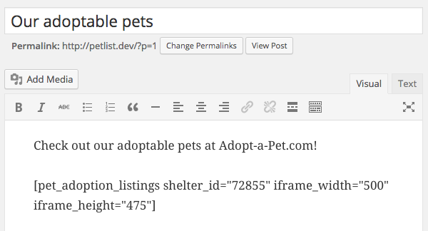
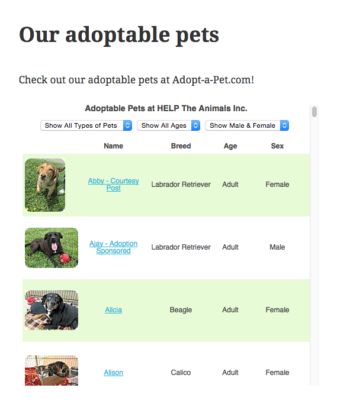
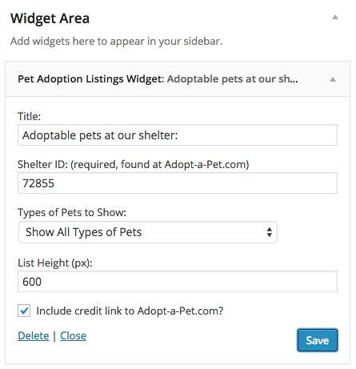
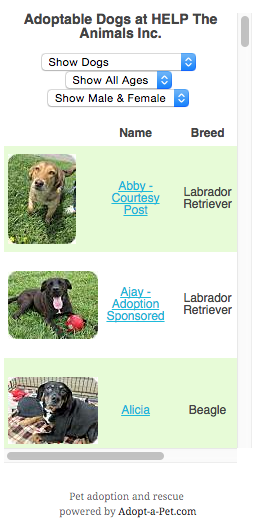

# Pet Adoption Listings

> Display adoptable pets from an Adopt-a-Pet.com shelter's listings.

    

## Description

This plugin provides two easy ways to display listings of adoptable pets from a shelter's profile at Adopt-a-Pet.com via iframe.

The first way is with a shortcode `pet_adoption_listings` that can be included in any post or page content. When used it will show the shelter's available pets from their Adopt-a-Pet.com profile. The only required attribute is `shelter_id` (obtained from Adopt-a-Pet.com) but you can also specify the iframe width and height.

The second way is with a widget that can display available pets in your sidebar or wherever else widgets are in your theme. You can specify the Shelter's ID (required, obtained from Adopt-a-Pet.com), the types of pets to show (defaults to All), and the height of the listing.

All pet detail links will open in a new browser window or tab on the Adopt-a-Pet.com website.

### The shortcode definition in the post editor

### The shortcode front-end display

### The widget configuration options

### The widget front-end display

## Requirements

* [WordPress](http://wordpress.org) 2.8+
* A shelter account at [Adopt-a-Pet.com](https://www.adoptapet.com/shelter/)

## Installation

Pet Adoption Listings is most easily installed automatically via the Plugins tab in your dashboard.

## Support Level

**Active:** I actively maintain this project, and expect to continue work for the foreseeable future including keeping tested up to the most recent version of WordPress.  Bug reports, feature requests, questions, and pull requests are welcome.

## Contributing

Pull requests and issues on [GitHub](https://github.com/ChrisHardie/pet-adoption-listings) are welcome.